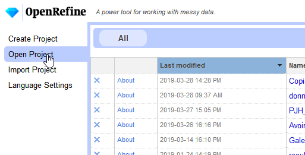
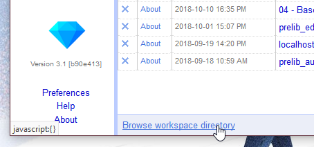
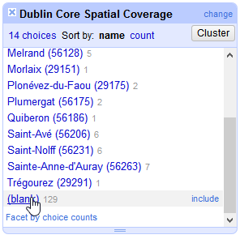
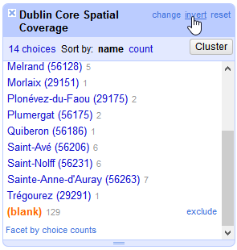
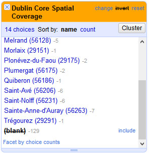
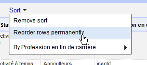

# Atelier OpenRefine, Nanterre, 5 avril 2019

A faire :
- Revenir sur la notion de row et records.
- Revenir sur la possibilité de réordonner les colonnes depuis le menu de la première colonne
- Modification de la valeur d'une cellule dans la facette ou avec _edit_ dans la cellule
- TP avec l'union de deux projets
- TP avec GREL (aborder les types de données)

[OpenRefine](http://openrefine.org) est un logiciel libre permettant de traiter des données : inventaires d'archives, bibliographies, réponses à des questionnaires, données prosopographiques, etc.

Avec OpenRefine, vous pourrez trier vos données, les filtrer, repérer des valeurs manquantes, incomplètes ou aberrantes, supprimer les doublons, harmoniser les valeurs, diviser le contenu d'une colonne en plusieurs colonnes ou plusieurs lignes, assembler le contenu de plusieurs colonnes en une seule, enrichir les données à partir de bases de données telles que [Wikidata][70123744].

  [70123744]: https://outiquanti.hypotheses.org/875 "Découverte de Wikidata"

OpenRefine peut importer des données tabulaires, c'est à dire structurées en lignes et en colonnes telles que des fichiers Microsoft Excel, LibreOffice Calc, OpenOffice Calc, Google Documents, [CSV][61446736], TSV. Il peut aussi importer des fichiers XML, JSON ou des données stockées dans des bases de données relationnelles (de type MySQL ou PostgreSQL).

  [61446736]: https://fr.wikipedia.org/wiki/Comma-separated_values "Comma-separated values"

Dans quels cas OpenRefine pourrait vous être utile ? Vous avez récupéré [le fichier Excel de l'inventaire](https://f.hypotheses.org/wp-content/blogs.dir/2183/files/2018/12/Inventaire-des-cylindres-phonographiques-du-CRBC.xlsx) des [cylindres phonographiques](https://fr.wikipedia.org/wiki/Cylindre_phonographique) du [Centre de recherche bretonne et celtique](https://bylg.hypotheses.org/464). Dans ce fichier, chaque ligne correspond à un cylindre et vous avez remarqué qu'une colonne, _Dublin Core Spatial Coverage_ contient le nom de la commune d'où proviennent les cylindres. Vous aimeriez bien afficher les communes sur une carte mais vous ne savez pas comment récupérer leurs coordonnées géospatiales. Vous remarquez également quelques erreurs de saisie en appliquant un filtre dans Excel. Par exemple, Saint-Avé a été saisi une fois « Saint Avé » (sans tiret) et cinq fois « Saint-Avé » (avec un tiret). Vous remarquez également que la colonne peut contenir deux noms de communes, séparés par un point-virgule : Saint Avé (56206); Morlaix (29151).

OpenRefine peut vous servir à :
1. identifier les erreurs de saisie et les corriger,
2. séparer les noms de communes,
3. récupérer les coordonnées spatiales depuis la base de données Wikidata,
4. exporter les noms des communes et les coordonnées spatiales pour les afficher sur une carte du site [uMap][5e5df6f9].

  [5e5df6f9]: https://umap.openstreetmap.fr/fr/ "uMap"

Sous OpenRefine vous ne pourrez pas appliquer des formules mathématiques (calcul de sommes, de moyennes, test du Khi2, exponentielles, etc.) ou dessiner des graphiques comme vous pouvez le faire avec Excel ou LibreOffice Calc. Vous pourrez supprimer des colonnes avec OpenRefine mais pas des lignes.

## Installation de OpenRefine
OpenRefine fonctionne sous Microsoft Windows, Mac OS et Linux. Vous trouverez toutes les instructions d'installation sur [la documentation officielle](https://github.com/OpenRefine/OpenRefine/wiki/Installation-Instructions) (en anglais) ou sur [le cours de Mathieu Saby](https://msaby.gitlab.io/atelier-openrefine-MASA/installation-lancement-desinstallation.html) (en français). Sous Windows, vous aurez probablement besoin d'installer le logiciel [Java](https://www.java.com/fr/download/) (Java est installé par défaut sous Mac et Linux).

OpenRefine est en anglais par défaut. Il est conseillé de conserver l'interface dans la langue de Shakespeare car la documentation officielle et la grande majorité des tutoriels que vous trouverez sur internet sont en anglais. Si vous préférez toutefois changer la langue, allez dans le menu _Language Settings_ affiché à gauche de [la page d'accueil](http://127.0.0.1:3333/) de OpenRefine.

## Atelier n°1 : Nettoyage d'une liste de communes bretonnes et récupération des coordonnées géographiques sur Wikidata

Pour le détail des opérations, voir [Créer une carte avec Wikidata, OpenRefine et uMap](https://bylg.hypotheses.org/543).

## Avant d'aller plus loin
### Une interface web

L'interface de OpenRefine est accessible depuis une page web (http://127.0.0.1:3333/). C'est pourquoi votre navigateur web par défaut est lancé au démarrage de OpenRefine.

Mais qui dit navigateur web ne dit pas « accès autorisé à tous ». Vous êtes seul à pouvoir accéder à cette interface et les données importées restent sur votre ordinateur.

### Un fonctionnement par projets

OpenRefine fonctionne par projet. Il faut créer un projet pour importer des données.

Pour revenir sur des données précédemment importées, il faut ouvrir le projet associé. Pour accéder de nouveau aux données de l'inventaire des cylindres phonographiques, cliquer dans le menu de gauche _Open Project_ (_Ouvrir un projet_) depuis la page d'accueil.

### Une sauvegarde automatique

Tant que le projet n'est pas supprimé, les données importées restent présentes dans OpenRefine.

Il n'y a pas de Ctrl + S ou de Pomme + S dans OpenRefine pour sauvegarder votre projet. Toutes les opérations depuis l'importation des données sont automatiquement sauvegardées dans l'historique du projet.

De même, il n'y a pas de Ctrl + Z ou de Pomme + Z dans OpenRefine. Pour annuler une opération, il suffit d'aller dans l'historique du projet et de cliquer sur l'étape précédente.

### OpenRefine ne modifie pas vos fichiers originaux

OpenRefine ne modifie pas les fichiers originaux Excel, LibreOffice, CSV, etc. Il importe les données et les sauvegarde dans son dossier de travail. Pour afficher, le dossier de travail, allez dans la liste des projets (menu _Open Project_) puis cliquez sur _Browse workspace directory_.

Le contenu du dossier de travail ne vous permettra pas de récupérer vos données une fois nettoyées, vous utiliserez pour cela les fonctions d'exportation de OpenRefine, affichées en haut et à droite de chaque projet. Mais il est conseillé de sauvegarder le dossier de travail avant une mise à jour de OpenRefine. Si vous changez d'ordinateur, vous pourrez récupérer vos projets en cours en copiant ce dossier.

### Le même menu pour chaque colonne

Les menus dans OpenRefine ne sont pas affichés comme dans des logiciels classiques (Word, Photoshop, Firefox, etc.) mais apparaissent en cliquant sur les flèches à côté du titre de chaque colonne. Les menus de chaque colonne, à l'exception de la première colonne du projet proposent toutes les mêmes fonctions.

### Supprimer les espaces de début et de fin

Bonne pratique avant de traiter les données d'une colonne : Appliquer la fonction de suppression des espaces supplémentaires : _Edit cells > Common transforms > Trim leading and trailling whitespace_ (_Editer les cellules > Transformations courantes > Supprimer les espaces de début et de fin_). La présence d'espaces supplémentaires arrive fréquemment, autant régler tout de suite le problème.

### Filtrer les données d'une colonne avec une facette

L'équivalent OpenRefine des filtres de Excel ou LibreOffice Calc sont les facettes. Pour avoir un aperçu rapide des valeurs d'une colonne, ou filtrer les lignes du projet en fonction des valeurs d'une colonne (par ex. afficher tous les cylindres dont la commune contient le mot « Saint »).

Vous pouvez cumuler l'affichage de plusieurs facettes (ex. afficher uniquement les cylindres dont la commune contient le mot « Saint » et de la marque « Maison de la bonne presse »).

Vous pouvez afficher l'inverse d'une sélection. Par exemple, dans l'inventaire des cylindres phonographiques, la commune (la colonne _Dublin Core Spatial Coverage_) n'est pas toujours indiquée. Pour afficher les cylindres sans commune, on applique une facette textuelle (_Text facet_) sur la colonne et on clique sur _(blank)_.

Pour afficher uniquement les cylindres pour lesquels la commune a été renseignée, on clique ensuite sur _invert_.

L'entête de la facette prend alors une couleur jaune pour indiquer qu'elle affiche l'inverse d'une sélection. Pour réinitialiser la facette, cliquez sur _reset_.

Attention, les fonctions ne s'appliquent que sur les lignes affichées. Pensez à réinitialiser les facettes pour appliquer une fonction sur toutes les lignes du projet.

### Tris permanents

Lorsque vous appliquez un tri sur une colonne (commande _Sort_ du menu de la colonne), les lignes sont affichées dans l'ordre du tri, mais il ne s'agit que d'un affichage, l'ordre des lignes, indiqué par le numéro affiché dans la première colonne, _All_ (_Toutes_), reste identique. Par conséquent, si vous exportez les données après un tri non permanent, vous constaterez dans le fichier d'export que les lignes auront conservé leur ordre original. De même, si vous quittez le projet, le tri ne sera pas sauvegardé. Pour rendre un tri permanent, cliquez sur _Reorder rows permanently_ du menu _Sort_.

## Atelier n°2 : Nettoyage des réponses à un questionnaire

Autre exemple. Vous souhaitez exploiter les réponses à un questionnaire en ligne mais certaines réponses étaient libres, notamment la commune de résidence et les diplômes obtenus. Comment uniformiser les réponses pour les analyser avec le logiciel R ?

[Télécharger le fichier XLS](Files/Avoir60ans.xlsx)

1. Créez un nouveau projet OpenRefine et importez le fichier Excel.
2. Appliquez une facette textuelle sur la colonne de la commune de résidence.
3. Supprimez les espaces de début et de fin.
3. Uniformisez les noms des communes. Les noms des communes doivent commencer par une majuscule et il faut supprimer les départements indiqués entre parenthèses.

Pour uniformiser le nom des communes, trois solutions :

Editer à la main les cellules du tableau (commande _edit_ au survol des cellules du tableau ou au survol des valeurs affichées dans la facette).

Le problème, avec les précédentes solutions, c'est qu'elles ne permettent pas d'identifier formellement les communes. Par exemple, Tréméven est-elle [Tréméven](https://www.wikidata.org/wiki/Q688371) dans le Finistère ou [Tréméven](https://www.wikidata.org/wiki/Q214578) dans les Côtes-d'Armor ? La solution : Utiliser la réconciliation avec Wikikata : Faire une copie de la commune originale (_Edit column > Edit column based on this column_) puis sur la nouvelle colonne : _Reconcile > Start reconciling_.
